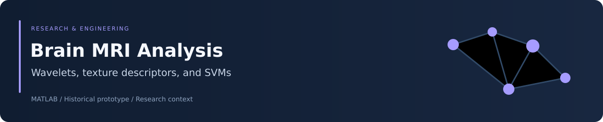
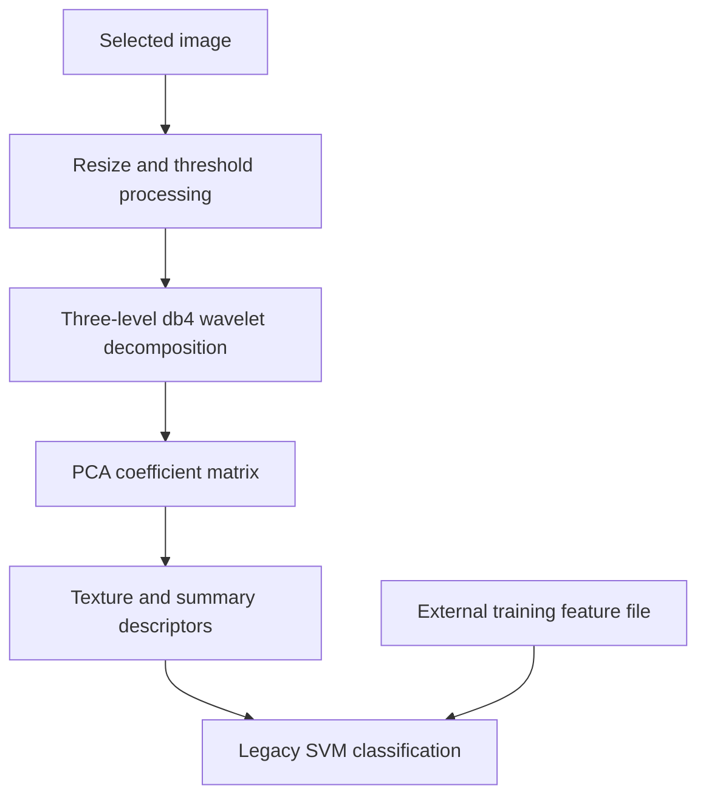

<div align="center">



# Brain MRI Feature Analysis

### A historical MATLAB prototype using wavelets, texture features, and SVMs


[Overview](#overview) · [Pipeline](#analysis-pipeline) · [Requirements](#requirements-and-missing-assets) · [Evaluation](#evaluation-boundaries)

</div>

## Overview

This repository contains a MATLAB script and GUIDE callback code exploring brain-image preprocessing, wavelet analysis, handcrafted descriptors, and benign/malignant classification with support vector machines.

It is a historical educational prototype. **The checkout is incomplete for end-to-end classification and is not a clinically validated tumor detector.** The documentation below distinguishes source capabilities from missing assets and methodological limitations.

## Repository contents

| File | Purpose |
|---|---|
| [Brain_DWT_PCA.m](Brain_DWT_PCA.m) | Interactive image-processing, feature, classification, and evaluation script |
| [BrainMRI_GUI.m](BrainMRI_GUI.m) | GUIDE interface callbacks |
| [crossfun.m](crossfun.m) | Incomplete cross-validation helper |
| [crossfun_Parameters.m](crossfun_Parameters.m) | Legacy parameter-search fragment |
| [Benign.zip](Benign.zip), [Malignant.zip](Malignant.zip) | Image archives with category names |

Archive names alone do not establish dataset provenance, clinical label validity, subject counts, or permitted reuse.

## Analysis pipeline



### Image processing

Images are resized to 200 × 200. The script includes Otsu thresholding and a Lab-color k-means step, but sets `nColors=1`; that step does not separate multiple tissue groups.

The GUI callback displays a thresholded image after small-component removal, while its feature branch uses a separate binary image. Displayed segmentation and extracted features therefore do not necessarily refer to the same mask.

### Wavelets and descriptors

The code applies three levels of `dwt2` using the `db4` wavelet, concatenates the third-level approximation/detail matrices, and calls `G = pca(DWT_feat)`.

**PCA convention:** with one output, MATLAB `pca` returns coefficients, not projected observation scores. The subsequent features are computed from that coefficient matrix; the current implementation is not conventional PCA score-based feature reduction.

The 13-element vector contains:

| Group | Descriptors |
|---|---|
| Co-occurrence features | Contrast, correlation, energy, homogeneity |
| Summary features | Mean, standard deviation, entropy, RMS, variance |
| Additional descriptors | Smoothness, kurtosis, skewness, inverse-difference-style sum |

Descriptor names should be interpreted according to their exact source formulas rather than assumed to match a standard validated radiomics definition.

## Requirements and missing assets

The routines use MATLAB functionality from Image Processing, Wavelet, and Statistics and Machine Learning toolboxes. They also depend on legacy APIs such as `svmtrain`, `svmclassify`, `im2bw`, `makecform`, and `applycform`, whose availability depends on MATLAB version.

| Required asset | Status in this checkout |
|---|---|
| `Trainset.mat` with `meas` and `label` | Missing |
| `Normalized_Features.mat` with `norm_feat` and `norm_label` | Missing |
| `BrainMRI_GUI.fig` for the GUIDE interface | Missing |
| Complete portable evaluation helpers | Not provided |

The image ZIP files do not replace the missing training feature matrices or GUI figure.

## Inspecting the project

```bash
git clone https://github.com/Foysal-A-Al/Matlab-project-Brain-tumor-detection.git
cd Matlab-project-Brain-tumor-detection
```

Set MATLAB's Current Folder to the repository and inspect the sources:

```matlab
edit Brain_DWT_PCA
edit BrainMRI_GUI
```

The script entry point is `Brain_DWT_PCA`, but it cannot complete classification without the external MAT files and a compatible environment. `BrainMRI_GUI` also requires the missing FIG asset. This README does not claim a working launch from the current checkout.

Before restoring an experiment, document the source and schema of those assets, ensure `size(meas,2)` matches the 13-feature vector, and normalize image modes explicitly. The current script assumes RGB-like input in several operations.

## Evaluation boundaries

The source includes hold-out evaluation and kernel comparisons, but its historical output/comments should not be treated as verified performance:

- GUI callbacks report a maximum over repeated hold-outs, which does not provide an unbiased estimate of generalization.
- The script's five-fold block iterates over label count rather than the five fold identifiers.
- A shared `classperf` object is reused across kernel evaluations in the script.
- `crossfun.m` ends in an incomplete expression; the parameter helper has a filename/function-name mismatch and undeclared inputs.
- Patient-level separation, leakage controls, segmentation ground truth, and external clinical validation are not established by the available files.

No accuracy claim, Dice score, clinical usefulness claim, or passing runtime test suite is made here. MATLAB execution and ZIP contents were not verified in this documentation update.

## Reproducibility priorities

Recover the original assets and provenance first. Then use a documented MATLAB version, one shared feature-extraction routine, training-only preprocessing, explicit patient-level partitions where applicable, independent evaluation objects, and complete fold loops.

Modernizing to `fitcsvm`/`predict` or App Designer is future work requiring parity checks, not an implemented capability.

## Attribution and use

Identify the repository commit, original data source, MATLAB environment, and any externally supplied training assets when citing or reproducing this work.

Maintained by [Abdullah Al Foysal](https://github.com/Foysal-A-Al). The former README mentioned MIT, but no license file is included in the current tree; an applicable license should be clarified before redistribution.

This prototype is for education and research, not diagnosis or treatment decisions.
